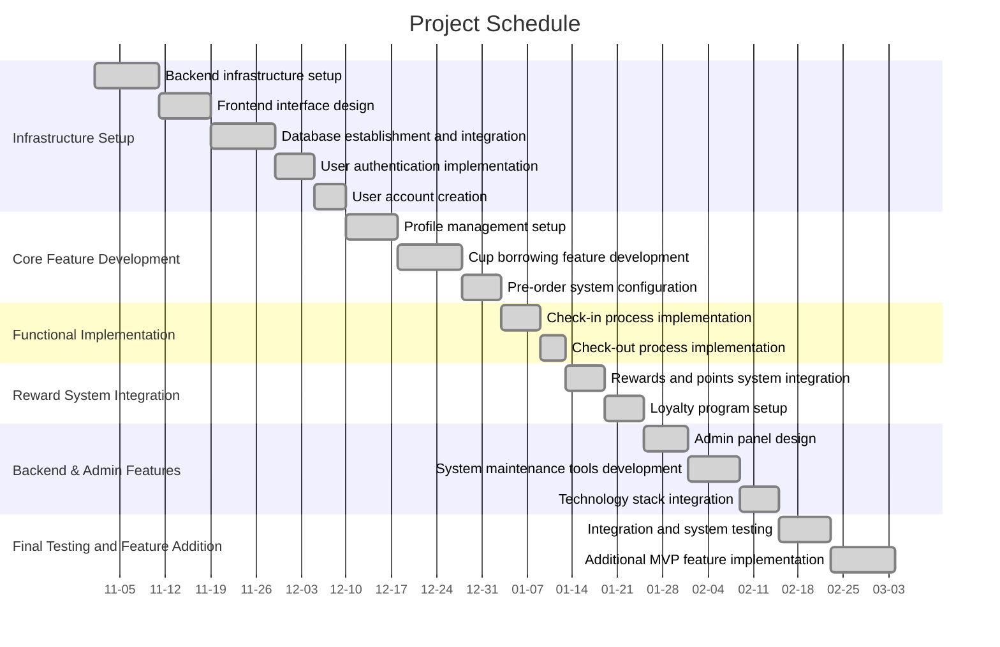

# Software Design Document

## Structure

### Title Page

LoffeeCoffee: Amina Abdulkhalek, Tristan Norbury, Wasif Zaman, Shadi Simon, Dario Maslic
  
### Vision Statement

LoffeeCoffee aims to bring forward a fundamental change to the way coffee enthusiasts enjoy their daily brew. Our mission is to halve the number of single use cups by 2050. Inspired by our dedication to sustainability and minimising single waste papers and plastics, consumers can now access a never before seen cup sharing scheme. At Loffee, we give our subscribers access to a wide network of reusable cups, accessible when ordering a beverage from a particpating cafe. Now subscribers can get access to discounted drinks, earn points on eligible purchases, and savor their morning brew without impacting the environment negatively.

### System Design Document

Architecture is a critical aspect of designing a system, as it sets the foundation for how the system will function and be built. This is the process of making high-level decisions about the organization of a system. Creating a system design document for a reusable coffee cup tracking system involves outlining the key aspects of the system’s architecture and functionality:

System Design Document: Reusable Coffee Cup Tracking System

Table of contents:
- 1.1	Purpose: This system, introduces the document as a blueprint for designing a system that promotes reusable coffee cups through RFID technology. 
- 1.2	Scope: This could include the system's functionality, components, and user roles. It clarifies what is within the project boundaries.
- 1.3	Document Conventions: This part details any conventions used in the document, such as special terminology or notation.

2. System Overview
- 2.1 System Architecture: This section exposes the overall design of the system. You could explain whether you are using a microservices architecture, client-server model, or another system architecture, client-server model, or another system architecture.
- 2.2 System Components: This system provides a high-level list of the main components of the system. In this case, this might include RFID tag infrastructure, a user interface, etc.

## System Architecture
The system architecture is designed to efficiently track and promote the use of RFID-enabled reusable coffee cups. There are the following main components and their interactions:

1. User-Facing Mobile Application:
	- The mobile app serves as the primary interface for users to engage with the system. It offers an intuitive and user-friendly experience:
	- Cup selection: Users can browse and select the type of reusable coffee cup they prefer, including size, design, and material.
	- Order & payment: users can place orders, make payments, and pre-order their coffee for pickup at partner locations.
	- cup tracking: Users can track the location and status of their RFID-enabled cups within the system.
	- Rewards & Promotions: The app provides information about rewards programs and promotions, encouraging users to choose reusable cups. 
1. Backend Services:
	- Backend services support the core functionality of the system. They handle user-related data, cup–tracking, transaction processing, and coordination with other staff and business-related partners:
	- User Account Management: The service manages user accounts, including registration, login, and profile management.

### Key Design Considerations:

- Data Security and Privacy: The system will implement robust security measures, including data encryption and secure authentication protocols, to protect user data and cup tracking information.
- Offline Mode: The mobile app will be designed to function in an offline mode, allowing users to browse coffee shops, view cup types, and place orders even when they are not connected to the internet.
- Concurrent Processes and Coordination: The system will efficiently handle concurrent processes, particularly in the order processing and data synchronization phases.
- Cup Tracking Services: Responsible for tracking the real-time location and status of RFID-enabled cups.
- Transaction Processing: This service manages the processing of user orders. It ensures that cups are available, processes orders, and coordinates with partner locations for cup pickup and return.

### RFID Infrastructure:

The RFID infrastructure includes the hardware components necessary for tracking the RFID-enabled cups. This infrastructure consists of:
- RFID Scanners: These are RFID readers deployed at participating locations, such as coffee shops and designated cup return spots. They are responsible for scanning RFID-enabled cups and updating their location within the system.
- Hardware Integration: The infrastructure includes the necessary hardware components to ensure smooth communication between the RFID scanners and the backend services.
  
1.	Product Developed by the SDD Team:
	- The SDD (Software Development and Design) team developed a system that promotes the use of reusable coffee cups integrated with biodegradable RFID tags. The system includes a mobile application, backend services, RFID infrastructure, and a database for tracking and managing these cups. It offers users a convenient way to access, order, and return reusable cups without the need to carry or clean them.

Storage/Persistent Data Entities
1.	Data Types and Entities

Identify the key data entities and their attributes
•	RFID Tag Data: Information related to each individual coffee cup's RFID tag, including its unique identifier, cup type, and cup owner.
•	User Data: Information about registered users, including their profiles, preferences, and payment methods.
•	Transaction Data: Records of each transaction, detailing which cup was used, when and where it was used, and the associated user.
2. Database Selection
Choose an appropriate database system based on the project's requirements. Given the need for flexibility and scalability, a combination of the following databases might be considered:

Relational Database: For structured data such as user profiles and transaction records.
NoSQL Database: For unstructured or semi-structured data, such as RFID tag data and cup-related information.
3. Data Synchronization
Define a strategy for synchronizing data across distributed locations if your system operates in multiple locations or regions. This is important for ensuring real-time updates and consistency. Consider technologies like replication, caching, or event-driven architectures to achieve data synchronization.

Noteworthy trade-offs and choices

In the design and development of a system that promotes the use of reusable coffee cups with embedded RFID tags, there are several noteworthy trade-offs and choices that need to be carefully considered. Here are some of the key trade-offs and choices you might encounter:
1.	User Convenience vs. Environmental Impact:
	- Trade-off: Balancing the convenience of not having to carry or clean a reusable cup with the environmental impact of producing and disposing of RFID tags and cups.
	- Choice: Decide on the system's messaging and marketing strategy, emphasizing the long-term environmental benefits while addressing potential concerns about the use of RFID tags.
1. Cost vs. Quality of RFID Tags:

Trade-off: Choosing between lower-cost RFID tags that might be less durable or high-quality RFID tags that last longer but are more expensive.
Choice: Determine the appropriate balance between cost and quality based on the target market and the desired lifespan of the cups.
3. Centralized vs. Distributed Data Storage:
	- Trade-off: Deciding whether to centralize all data in a single database or use distributed databases for local storage and synchronization.
	- Choice: Choose an architecture that aligns with the scale and geographical distribution of your operation. Centralized storage may be more cost-effective but could introduce latency in distributed settings.
	
Concurrent processes (if any) and how they will be coordinated:

RFID Tag Read and Write Operations:
- Concurrent Processes: Multiple users placing or returning cups equipped with RFID tags.
- Coordination: Implement a locking mechanism or transaction management to ensure that each RFID tag is accessed by one user at a time to prevent conflicts and ensure data consistency

**User Registration and Profile Updates:**

Concurrent Processes: Multiple users registering accounts or updating their profile information.
Coordination: Use optimistic locking or timestamp-based versioning to manage concurrent updates to user profiles. Additionally, employ transaction management to ensure data integrity during account creation.

**Inventory Management:**

Concurrent Processes: Simultaneous updates to cup inventory, including additions and removals.
Coordination: Employ a locking mechanism or version control for inventory management to prevent race conditions and maintain accurate inventory counts.
User Notifications:

### Data Definitions
| Attribute | Type    | Meaning  | Example Data               |
|-------------------------|---------|--------------------------------------------------------------|----------------------------------|
| CupID                   | String  | A unique identifier for each RFID coffee cup.        | CUP001 |
| CupStatus               | Enum    | The current status of the coffee cup (In use, Available, Dirty) | In use |
| CoffeeShopID            | String  | An identifier for each participating coffee shop      | CAFE001 |
| SubscriptionID          | String  | A unique identifier for each coffee shop's subscription | SUB001 |
| SubscriptionStatus      | Enum    | The status of the coffee shop's subscription (Active, Inactive)  | Active |
| SubscriptionCups        | Integer | How many cups are allocated to a coffee shop's subscription | 100 |
| SubscriptionStartDate   | Date    | Start date of the coffee shop's subscription           | 2023-10-01|
| SubscriptionEndDate     | Date    | End date of the coffee shop's subscription.             | 2024-09-30 |
| LoyaltyPoints           | Integer | How many loyalty points earned by a coffee shop for selling reusable cups | 500 |
| CollectionPointID       | String  | An identifier for each collection point                   | COLLPT001  |
| ServiceTeamMemberID     | String  | The identifier for each service team member                | TEAM001 |
| ServiceTeamMemberName   | String  | Name of the service team member                        | Jason Smith |
| ServiceTeamMemberRole   | String  | The role of the service team member           | Service Team Manager |
| LocationHistory         | List    | The list of previous locations where the cup has been       | SHOP001, COLLPT001, SHOP002 |
| CupCleaningHistory      | List    | The history of cup cleaning and maintenance records         | `Date: 2023-10-05` `Action: Cleaned` `Date: 2023-10-10` `Action: Inspected`  |
| DeliveryRequest         | Boolean | Has a coffee shop has requested cup deliveries | true                           |

### Analysis and Design

#### Class Diagram

You need to do an initial design of your system -- what basic objects should it have? And what are the methods associated with those objects? You will represent your design decisions in a class diagram. In a full plan, you need to make sure any classes or methods in any sequence diagrams have been included in the class diagram -- it might help you to draw some sequence diagrams to help you to decide what your class diagram should contain. Method signatures should be given. The diagram must include, as appropriate classes, attributes, associations, inheritance and/or aggregation (if applicable) and multiplicities.

#### One or more State Diagrams for the more interesting objects in your design

State Diagrams: You are required to consider the relevant states of each object in your system and to submit state diagrams for those that have interesting states or complex behaviour. One way to measure if a state is interesting is to consider whether you need to test that state before performing a particular action or if the state changes after an action is performed. What is interesting will depend on the application.

### Requirements Traceability Matrix

Requirements Traceability Matrix (RTM): Set up an RTM with the following columns:

Requirement ID | Use Cases | Classes | Methods | Packages | Build Number
| :---: | :---: | :---: | :---: | :---: | :---: | 
FR001  | User / Cup location retrieval | `LocationService` | `getUserLocation` `getClosestCup`  | Access to Location Services (GPS) | |
FR002  | Cup Scanning and Tracking | `ScanCup` | `TrackCup`, `updateCupStatus` | Access to RFID scanner | | 
FR003  |  Cup Status (In use or at a cafe) | `CupStatus` | `getCupStatus`, `updateCupStatus` | SQL Database of user's cup activity | |
FR004 | Displays earned points and progress toward a free coffee | `LoyaltyStatus` | `getLoyaltyStatus` `updateLoyaltyStatus` | Access to user coffee purchases and stats database | |
FR005  | RFID Cup Scanning | `ScanCup` | `ScanRFID` | RFID Scanner Integration| |
FR006  | App-server synchronisation | `AppServerSync` | `syncCupStats` | App-Server Integration | |
FR007  | Allow user to make in-app purchases | `AppServerSync` | `getPaymentMethod`, `ValidatePayment`, `UpdateBalance` | Transaction Method Integration | |

> There should be one row for each requirement. For this deliverable, just fill in the first five columns, since the last column (and usually a couple more after that which I've already deleted) are concerned with the design of the system.

### List of design assumptions (if any)

This will help the reader to understand why you have done certain things. Please review the assumptions carefully before submission. (But note: A poor assumption should not be used as an excuse for poor design decisions.)

# Testing:

#### Criteria for pass/fail test:
* Output Specifications:
* User Coordinates (int x, int y)
* Closest Cup Provider Coordinates (int x, int y)
* True (Pass)  / False (Fail)

#### Process for reporting / managing defects:

Once a defect has been found, it is the responsibility of whoever has located it to report such. The reporter should lodge the error in the defect management system to notify developers. Following the completion of this, testers must complete a Software Test Report including all the information available to them. The responsibility is then that of the developers to track, manage, and solve the defect, using the defect management system to track the vulnerability.

#### Test Schedule:

Testing will occur between 11pm and 3am on the first Monday and Wednesday of every second month. If it overlaps with a public holiday, testing will be executed a week later. The set times are ideal, as they give developers ample time to fix any bugs which are detected during testing, while allowing time for developers to work on new features.

#### Testing Resources Required:

#### Test Environment:

    Hardware Requirements:
    * Desktop / Laptop & Mobile 

    Software Requirements:
    * Our system	
    * Defect Management System
    * Version Control System
    * Word Processing System to create reports, e.g. MS Word

####  Test Deliverables:
* Test Cases + Test scripts
* Defect must be lodged on Defect Management System
* Test Summary Report

#### Testing Milestones:
* Test Development
* Test Environment Setup Completion
* Test Cases Executed
* Defects Reported
* Defect Fixing Complete

#### Test Case Specifications:

Note:Test Case Identifier will reflect the RequirementID as defined in the SRS document.

#### Functional Requirements

<table>
  <tr>
   <td>Test Case Identifier
   </td>
   <td>Test Description
   </td>
   <td>Input Specifications
   </td>
   <td>Output Specifications
   </td>
  </tr>
  <tr>
   <td>FR_TC001
   </td>
   <td>
<ul>

<li>Pass potential coordinates to as an input to the function

<li>Test output coordinates against such of the closest cup provider.
</li>
</ul>
   </td>
   <td>User Coordinates 
   </td>
   <td>Closest Cup Provider Coordinates 
   </td>
  </tr>
  <tr>
   <td>FR_TC002
   </td>
   <td>
<ul>

<li>Scan QR code on cups in different lighting and angles

<li>Measure the number of passes and fails

<li>Has the cup added as borrowed to customer account
</li>
</ul>
   </td>
   <td>Cup RFID code
   </td>
   <td>True / False

Percentage of passes/fails
   </td>
  </tr>
  <tr>
   <td>FR_TC003
   </td>
   <td>
<ul>

<li>Test returned cup accounts, to see if system has flagged the cup as returned

<li>Test non-returned cups to see if karma points has been added
</li>
</ul>
   </td>
   <td>Returned Cup

Account

Borrowed Cup Account
   </td>
   <td>True / False

Percentage of passes/fails
   </td>
  </tr>
  <tr>
   <td>FR_TC004
   </td>
   <td>
<ul>

<li>Test Accounts to see nTimes cup borrowed
</li>
</ul>
   </td>
   <td>Account that has borrowed a cup at least 1 time
   </td>
   <td>Int:

The number of times user has borrowed a cup
   </td>
  </tr>
  <tr>
   <td>FR_TC005
   </td>
   <td>
<ul>

<li>Pressure testing on RFID scanners

<li>Is it at least 96% accurate
</li>
</ul>
   </td>
   <td>RFID Cup

RFID Scanners
   </td>
   <td>True / False

Percentage of passes/fails
   </td>
  </tr>
  <tr>
   <td>FR_TC006
   </td>
   <td>
<ul>

<li>Test response time, on 1000 accounts using system at the same time
</li>
</ul>
   </td>
   <td>1000 Accounts
   </td>
   <td>Double: nSeconds
   </td>
  </tr>
  <tr>
   <td>FR_TC007
   </td>
   <td>
<ul>

<li>Test returned cup accounts, to see if system has deducted balance
</li>
</ul>
   </td>
   <td>1000 Accounts
   </td>
   <td>Has the balance been deducted?

True / False
   </td>
  </tr>
</table>

#### Non-Functional Requirements

<table>
  <tr>
   <td>Test Case Identifier
   </td>
   <td>Test Description
   </td>
   <td>Input Specifications
   </td>
   <td>Output Specifications
   </td>
  </tr>
  <tr>
   <td>NFR_TC001
   </td>
   <td>
<ul>

<li>Response time test on FR_TC001

<li>Response time must be at most 3 seconds
</li>
</ul>
   </td>
   <td>User Coordinates 

(int x, int y)
   </td>
   <td>True / False

Percentage of passes/fails
   </td>
  </tr>
  <tr>
   <td>NFR_TC002
   </td>
   <td>
<ul>

<li>Pressure test on NFR_TC001 to see how many users can use application without compromising performance

<li>Is the users >= 1, 000, 000
</li>
</ul>
   </td>
   <td>User Coordinates 

(int x, int y)
   </td>
   <td>True / False

Percentage of passes/fails
   </td>
  </tr>
  <tr>
   <td>NFR_TC003
   </td>
   <td>
<ul>

<li>Utilise results from tests:

<li>FR_TC003, FR_TC004, FR_TC007

<li>Is it at least 96% accurate
</li>
</ul>
   </td>
   <td>As defined above
   </td>
   <td>True / False

Percentage of passes/fails
   </td>
  </tr>
  <tr>
   <td>NFR_TC004
   </td>
   <td>
<ul>

<li>Test to see if users can gain access at times outside of operation

<li>Test to see if users can access during operation

<li>Use NFR_TC002 for the above
</li>
</ul>
   </td>
   <td>Mobile Connections
   </td>
   <td>True / False

Percentage of passes/fails
   </td>
  </tr>
</table>

### Project Management

#### Minimal Viable Product

A description of the _minimal viable product_. This is a version of the product, that is suitable for the client, trusted customers, or early adopter to use for evaluation. Which of the requirements does it implement, and which part of the architecture needs to be in place?

### Features
#### Implemented Requirements:

1. **User Registration & Account Management:**
   - User account creation, profile management, and subscription tracking.
	   - `User validation` methods ensuring each user has appropriate login details and information such Authenticated emails and appropriate Credentials
	   - `profile management` allowing for the user to update crucial personal information such as email, phone number ,payment methods and Home address 
	   - ability to view current `subscriptions plans `ability to change to other subscription such as _low, medium, high and VIP with varying pay scales_ 

1. **Cup Borrowing & Ordering:**
    - Ability to borrow and return reusable cups with pre-ordering and QR code scanning.
	    - `QR code scanning` application allows facilities the user to borrow cups on participating coffee shops. moreover this process seamless retrieves all the relevant data for the user such as the user's account and permits cup borrowing
	    - `Preordering`: application allows for the user to schedule their Suitable time for coffee cups picks up this allows for streamline approach where the cups are readily available upon the arrival of the user at participating coffee shops.

2. **Check-In & Check-Out Functionality:**
    - Managing cups via check-in and check-out functions for accurate tracking.
	    - `Cup managment system` allowing the user Providing the user with the capability to able to manage borrowing status as checking in item would signals that start of the usage of the cups and whilst checking out would delineate the end of their usage.
	    - `updating cup status` dynamically changing the status of reusable cups based upon the user check-in and check-out the products. 

3. **Rewards and Points System:**
    - points are given based on the purchasing history such that more spending equates to more points for the user which can be contribute to the Loyalty program
	    - `Special Event Bonuses:`Encourage app usage by offering bonus points during special occasions or events, such as festive seasons or celebrations, where users receive extra points for each cup borrowed.

5. **Loyalty Program:**
    - `Tier-Based Exclusive Benefits:`The loyalty program offer exclusive benefits to users based on their tier level. To reach higher tiers, users should accumulate points by using the cups specifically usage of every 10-15 cups will gain points to the system. Once a user reaches a higher tier, they should be able to unlock special privileges, such as early access to limited edition themed cups. This will motivate them to continue engaging with the service.

**Architecture in Place:**

1. **Backend Infrastructure:**
    - A functional backend system managing user accounts, cup data, and transactions securely.
2. **User Interface:**
    - An intuitive and user-friendly frontend (mobile app or web interface) for smooth interaction and visibility of essential features.
3. **RFID Scanning Integration for Cup Return:**
    - RFID scanning for returning cups at designated points.
    - User account updates and confirmation notifications for successful cup returns.
4. **Onboarding Process for New Users:**
    - Seamless registration and subscription sign-up process within the app.
    - Provision of unique codes (e.g., QR codes) for new users to borrow cups.
5. **Admin Panel:**
    - An admin dashboard for order management, customer support, inventory monitoring, analytics, and system maintenance.

**QOL Functionality for MVP:**

1. **Push Notifications:** Alerts for order confirmations, reward updates, and tier advancements.
2. **Location Services Integration:** Enable user-friendly pick-up and drop-off point selection using Maps services.
3. **Environmental Impact Tracker:** Display the number of disposable cups saved by using the app.
4. **Detailed User Analytics:** Understand user behavior, preferences, and usage patterns for future feature updates.
5. **Customer Support Integration:** In-app chat or support system for user assistance and issue resolution.
6. **Payment Gateway Integration:** Seamless and secure transactions within the app.

|    **Technology Stack:**                                            |    
| --------------------------------------------------------------------------------- | 
|Frontend  `React/next.js/Tailwind` |
| Backend  `NodeJs/Python/GraphQL`                                                  |
| Database `MongoDB/PostgreSQL `                                                    |   
| Cloud Services `AWS or Firebase`|     
| Third-Party Integrations `Google Maps API/Stripe/PayPal/graphQL`                      |  

- decisions for each component of the tech stack 
	- **Frontend:** React Native for cross-platform compatibility.
	- **Backend:** Node.js with Express for server-side development , python.
	- **Database:** MongoDB and PostgreSQL for efficient data management.
	- **Cloud Services:** AWS or Firebase for scalability and reliability.
	- **Third-Party Integrations:** Google Maps API for precise location services, Stripe or PayPal for secure transactions.

**Testing Approach:**

- **Alpha Testing:** In-house testing for basic functionalities.
- **Beta Testing:** Limited release to a select user group for feedback and iteration.
- **Continuous Feedback Loop:** Regular updates based on user feedback and performance metrics.

#### Milestones

A description of the main implementation milestones, in the order in which they should occur in the project. A milestone marks the end of a stage in the project when a version of the product can be reviewed as a whole

### **Month 1: Infrastructure Setup**

- Backend infrastructure setup (`T1`)
- Frontend interface design (`T2`)
- Database establishment and integration (`T3`)
- User authentication implementation (`T4`)
- User account creation (`T5`)

### **Month 2: Core Feature Development**

- Profile management setup (`T6`)
- Cup borrowing feature development (`T7`)
- Pre-order system configuration (`T8`)

### **Month 3: Functional Implementation**

- Check-in process implementation (`T9`)
- Check-out process implementation (`T10`)

### **Month 4: Reward System Integration**

- Rewards and points system integration (`T11`)
- Loyalty program setup (`T12`)

### **Month 5: Backend & Admin Features**

- Admin panel design (`T13`)
- System maintenance tools development (`T14`)
- Technology stack integration (`T15`)

### **Month 6: Final Testing and Feature Addition**

- Integration and system testing (`T16`)
- Additional MVP feature implementation (`T17`)

#### Tasks

Describe the main tasks that need to be completed, in the form of a table. The table should include

- An ID for the task
- A description of the task
- Dependencies, i.e. tasks that need to be completed before this task can start.
- Effort. Since you do not know how, or even how many people work on the project, it does not make sense for this assignment to estimate workdays. Instead pick a suitable scale (S, M, L, XL or 1 to 5 stars or ...)
- Milestone. Which milestone do they belong to?

| Task ID | Description                            | Dependencies                       | Effort | Milestone |
| ------- | -------------------------------------- | ---------------------------------- | ------ | --------- |
| T1      | Backend infrastructure setup           | -                                  | XL     | Month 1   |
| T2      | Frontend interface design              | -                                  | L      | Month 1   |
| T3      | Database establishment and integration | T1                                 | M      | Month 1   |
| T4      | User authentication implementation     | T1                                 | S      | Month 1   |
| T5      | User account creation                  | T4                                 | S      | Month 1   |
| T6      | Profile management setup               | T5                                 | M      | Month 1   |
| T7      | Cup borrowing feature development      | T1                                 | M      | Month 2   |
| T8      | Pre-order system configuration         | T7                                 | M      | Month 2   |
| T9      | Check-in process implementation        | T7                                 | S      | Month 3   |
| T10     | Check-out process implementation       | T9                                 | S      | Month 3   |
| T11     | Rewards and points system integration  | T1                                 | L      | Month 4   |
| T12     | Loyalty program                        | T11                                | M      | Month 4   |
| T13     | Admin panel design                     | T1                                 | M      | Month 5   |
| T14     | System maintenance tools development   | T1                                 | M      | Month 5   |
| T15     | Technology stack integration           | T1                                 | L      | Month 5   |
| T16     | Integration and system testing         | T3, T4, T6, T8, T10, T12, T14, T15 | XL     | Month 6   |
| T17     | QOL MVP feature implementation         | T15                                | L      | Month 6   |

#### Risks

A table with the following types of risks
- Organizational risks that come from changes in the organizational environment. Think of changing stakeholders or management, or a change of mind of stakeholders or management.
- Requirements risks, that come from changes to the requirements, or wrong requirements, and the process of managing requirement changes.
- Technology risks that come from the software or hardware technologies that are used by the system. **Include here parts of the system that you may need from the team that works on the other half of the system, or parts that you both depend on.**
- Tools risks that come from the software tools and other support software used to develop the system.

For each risk include

- An ID
- A description of the risk.
- The probability of that risk happening (use an appropriate scale: low to high, or 0% to 100%, or ...)
- The severity of the risk (use an appropriate scale: none to catastrophic, or 0 to 10, or ...)
- Mitigation strategies. Suggest measures that can be taken to reduce the risk.

> Since you do not know how many people work on the project, or what resources you may have, it does not make too much sense to talk about people risk, or estimation risk, yet. Furthermore, if something like a probability is unknown, is better to say that it is unknown, instead of making something up.

|Risk ID|Description|Probability|Severity|Mitigation Strategies|
|---|---|---|---|---|
| OrgR1 | Changes in senior management such as change in client, PM, and upper managements | Medium | High | Regular stakeholder meetings to address concerns and changes. |
| OrgR2 | Stakeholder indecision or changes in priorities, for instance, creating new features to meet end user's demands | High | Medium | Continuous and clear communication with the client to align expectations. |
| ReqR1 | Incomplete or Ambiguous Requirements | High | High | Document and validate requirements meticulously. Ensure detailed project scope and requirements documentation to ensure that they aren't open to misinterpretation. |
| ReqR2 | Incorrect interpretation of requirements | Medium | Medium | Hold detailed requirement review meetings with stakeholders regularly. |
| TechR1 | Dependency on critical external APIs or software, such as GraphQL and Stripe | Medium | High | Identify backup solutions or alternatives for critical APIs. Ensure clear contracts and service-level agreements. |
| TechR2 | Integration issues with the partner's system | High | High | Early and consistent communication and testing with partners to ensure system compatibility. |
| ToolsR1 | Tools compatibility issues or tool failure | Medium | Medium | Regularly update and maintain software tools. Address compatibility issues promptly to minimize workflow disruptions. |
| ToolsR2 | Lack of team training or expertise with specific tools | Low | Medium | Conduct training sessions or hire experts for tool-specific tasks. Ensure team members are proficient with essential tools. |
| CommR1 | Communication breakdown between teams or stakeholders | Medium | High | Set up periodic meetings and maintain open communication channels to resolve issues. |
| PlannR1 | Poor project planning leading to scope creep | High | High | Implement strict change control procedures and review the project scope frequently to avoid unplanned scope increases. |
| StaffR1 | Team member unavailability or resource limitations | Medium | Medium | Cross-train team members, maintain clear documentation, and establish contingency plans to address resource gaps. |
|SecurR1|Inadequate Validation - requirements haven't been validated by experts in the appropriate subject.|High|High|Ensure that all requirements are validated by the appropriate experts. For example, a financial system's requirements need to be reviewed by a security analyst.|

### Summary   
This SDD document outlines the architecture, design considerations, and the key aspects of the reusable coffee cup tracking system. The whole idea of the system is to promote sustainability, this is done by correctly managing RFID-tagged coffee cups within participating coffee shops. This SDD document covers various sections ranging from the system overview, the architecture, data, class diagrams, and the testing strategies.  

Key Highlights:    
- System Architecture - The document outlines an overview of the systems architecture which includes the user mobile application, backend server, RFID infrastructure, and the database.  
- Data Entities - The document defines the crucial data attributes and their role in the system. 
- Design Assumptions - Any design assumptions that are made are outlined to provide insight into the decision-making process.  
- Testing Strategies - Test cases for the functional and nonfunctional requirements are described, this also includes risk assessment and the mitigation strategies.
- MVP - Outlined are the features such as user registration, rewards, and loyalty programs.
- Tasks/Milestones - The project is divided into milestones and tasks which helps provide a clear roadmap for the development.

### Outlook 
The next steps for the development of the reusable coffee cup tracking system will involve some key steps:   

- The infrastructure setup will focus on setting up the backend and establishing the database.
- Developing the core features including profile management and pre order system.
- The reward system and loyalty program integration which will provide users with greater incentives for using the cups
- Backend and Administration features will be designed and implemented to account for maintenance will be implemented.

### Appendices

- Log of interactions with stakeholders.
- References.
- Third-party-resources

##### interactions with stakeholders 

-  interview stakeholders to gather information on the system's operation and the number of features required. During these interviews, stakeholders may provide valuable insights into their feature requirements, such as:
	- User Registration & Account Management, Cup Borrowing & Ordering, Check-In & Check-Out Functionality, Rewards and Points System, and Loyalty System. 
	- Having this information  increases the understanding of the system, making it possible to comprehend and create a minimal viable product (MVP). 

## Note

> Do not forget that we also expect you to complete an individual reflection on iLearn

