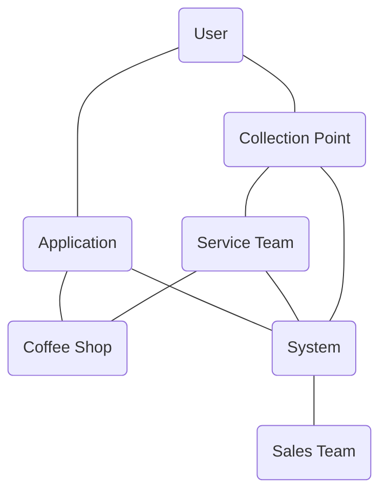
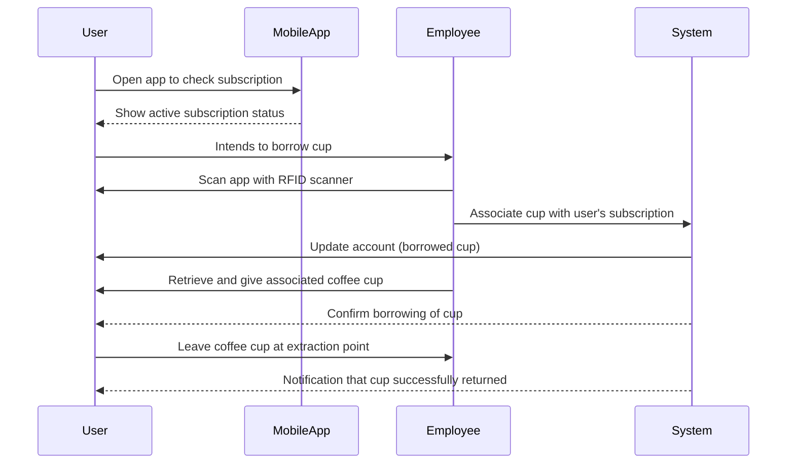

# Software Requirements Specification

> Use this markdown file to create the report. For the submission print this document to a PDF, and upload it to iLearn. The maximum number of pages is 30.
> Use the document structure below.

## Structure

### Title Page
- Project name:
  * Loffee
- Team Members:
  * Al Hassan Choubassi (A)
  * Segun Kayode (S)
  * Tahsin Bin Sohail (T)
  * Xavier Verdianto Tandova (X)
- Vision statement 
  To create a comfortable way of distributing reusable coffee cups. Loffee firmly believes that reducing the amount of possible waste can go a long way in saving our planet. We can provide people a way of doing this by using our system that lets users easily be able to gain access to coffee cups that would eventually be returned. With this, coffee lovers can now enjoy their coffee peacefully without worrying about the environment.

  The customers, environment and ease of usage are the three principles guiding Loffee in our journey to reduce waste to the environment. We work hard to ensure that users will be able to contribute to a greener world while also enjoying their daily dose of coffee. To create a world where enjoying a cup of coffee occasionally isn't a detriment to the future generations.
   
### Change Log
</img>
  - 31/07/2023: Added project name (A), team members' names (T), vision statement (X), and logo (S).
  - 06/08/2023: Added first minutes (A).
  - 27/08/2023: Added completed introduction (A), added completed use case section (A).
  - 30/08/2023: Added the Functional and Non-Functional Requirements (X).
  - 31/08/2023: Added the Overall Description (T), and added some References (T).
  - 01/09/2023: Added Discussion section, Elicitation Methods, and Outlook (S).
  - 09/07/2023: Added the Log of interactions and Third Party Resources (T).
  - 08/09/2023: Committed Third Party Resources to appropriate directory (A).

### Introduction

This document is intended to provide a comprehensive description of the software requirements for the reusable, trackable coffee cup service system, aptly named Loffee. The primary purpose of this document is to ensure that the client and the development team are on the same page with regard to the functionalities and constraints of the system. The intended readership of this document includes the client, project stakeholders, software developers, project managers, the quality assurance team, and any other related parties. The document follows the conventions of a standard Software Requirements Specification (SRS) structure.

The system aims to promote the use of reusable coffee cups by implementing a subscription-based service where customers can borrow and return cups across various participating coffee shops and collection points. The system will encompass:
* A mobile application for users to manage their subscriptions, view the number of cups borrowed and access coffee shop loyalty programs.
* A back-end system for coffee shops to scan cups during the borrowing and return processes.
* A dashboard or interface for the sales team to monitor current subscriptions, view sales data, track unreturned cups, and prevent potential abuses by users.

The system will **not** cover:
* The manufacturing or distribution of the RFID-tagged coffee cups.
* The physical setup of collection points.
* The recruitment or training of the sales team.
* The operations of the affiliated coffee stores.
* Any marketing or promotions.

The following is a list of common terms and abbreviations that will be used throughout the document:
- **RFID**: Radio-Frequency Identification. A technology used for tracking objects via radio waves. In the context of this project, it refers to the tags embedded in the reusable coffee cups.
- **Subscription**: A service model where users pay a recurring fee to access or utilize a service. Here, it refers to the service allowing users to borrow and return coffee cups.
- **Participating Coffee Shops**: Coffee shops that have agreed to be part of the "Coffee Cup Swap Service" and will facilitate the borrowing and returning of cups. 
- **Extraction Points**: Strategically placed points (train stations, shopping centers, libraries, etc.) where users can drop off borrowed coffee cups. The participating shops themselves are also extraction points.
- **Loyalty Program**: A marketing strategy where customers earn rewards based on their purchase frequency and other target metrics. 
- **Dashboard**: An interface for the sales team to monitor and manage user subscriptions, track cup borrowings and returns, and access other relevant data.
- **Mobile App**: A software application developed for use on smartphones and tablets, allowing users to manage their subscriptions and interact with the Loffee service.

### Overall Description:

In order to keep up with the ever-changing environment, we need to be able to make changes to our day-to-day habits. Therefore, if we want to have a trackable and reusable coffee cup, we need to have an app that oversees the whole account of the Customer.

The app can be used to borrow a certain number of coffee cups in participating shops and will manage the overall subscription of the user. The user can preorder the cup with their order or make the orders in person by scanning the QR code in the shops. There will be a "check-in" and "check-out" function which will be used to manage the coffee cups the user holds. The app will also offer various rewards for the user to enjoy and it will give points to the user to motivate them to keep using the program.

Finally, the app will offer a Loyalty Program to the users that will grant users extra benefits like getting discounts or a free cup after 10-15 cups are used. There will also be  a tier system in the Loyalty program. The customers in the higher tiers will also have the added functionality to get limited edition themed cups for various occasions.

A wide variety of people will use the app according to their requirements. The customers (including people from students, and office workers to normal people) will use the app to order coffee and coffee cups, keep track of their points and rewards, and manage other tasks like choosing preferred pick-up and drop-in points. The coffee enthusiasts will be mostly on the loyalty program and will use the app to get added benefits on top of the aforementioned benefits. On the other hand, there will also be a maintenance crew who will maintain and update the app regularly. Finally, admins will be able to take or cancel orders on behalf of the customers.

The app might require a strong internet connection at all times as it needs to track the coffee cups. Along with that, the user must also keep their phone location on  to use the app.

The app will depend on other third-party apps like Google Maps to give a precise location of the Restaurants. Other than that, it will also use some Camera features to scan QR codes.

### Specific Requirements

Functional Requirements

| Requirement ID | Description | Must/Want | Fit Criteria |
|------|---|---|---|
| FR001 | A search function to see the nearest coffee cup that is available near their area. | Must | The app will display the coffee cups on a map with pointers along with suggestions for the closest coffee cup. |
| FR002 | User will be able to scan the coffee cup with the app. | Must | The app should be able to scan the coffee cup reliably when borrowing and returning. |
| FR003 | System will be able to detect if a user borrowed but doesn’t return.  | Must  | System will increment the user’s karma points by one every single time this happens. |
| FR004 | The app should also be able to list the loyalty program for the sale of coffee.    | Want  | The app will track the number of times the user has successfully borrowed and returned the cups and allow them a free cup every x amount of times. |
| FR005 | The RFID in the coffee cup will be able to be detected by the RFID scanners.  | Must  | The coffee cups that have already been borrowed have to be immediately notified to the server so other users won’t be bothered only to find out a cup isn’t there. |
| FR006 | The app and server should be synced properly for real-time information.  | Must  | The coffee cups that have already been borrowed have to be immediately notified to the server so other users won’t be bothered only to find out a cup isn’t there. |
| FR007 | The system will be able to deduct the balance.  | Must  | The app should be able to charge the payment method or deduct the in-app balance. |

Non-functional Requirements

| Non-functional Requirement ID | Description | Must/Want | Fit Criteria |
|------|---|---|---|
| NFR001 | The app should show the nearest coffee cup around the area within 3 seconds. | Must | On a stable internet connection, the app should be able to show the nearest coffee cups near them within 3 seconds. On a slightly less stable internet connection, a buffer of up to 7 seconds would be allowed. |
| NFR002 | The system should be able to handle 1 million people without bottlenecking the performance. | Must | The system should be able to accommodate the number of coffee lovers within a city. |
| NFR003 | The system should be reliable enough to have 96 percent accuracy. | Must  | The system should show the correct cups nearby and be able to scan with the app reliably without the user needing to reattempt to rescan.. |
| NFR004 | The app should be available during business hours. | Must | The app should be available during the business hours of food which would normally be between 8 am to 11 pm if convenience stores were to be included. |

### Use cases

#### Main Use Case Diagram

The above diagram demonstrates the overall use case for the Loffee system. The user interacts with the application to get and use their coffee cups, and they also leave their cups at extraction points. When the application is used, it interacts with the coffee shop, and also the overall system and database to update and add records. The service team interacts with the system to know where to collect coffee cups from, and they deliver these to the coffee shops. The sales team uses the system for various tasks, including monitoring users, viewing and analyzing sales data, and tracking cups. 

#### Use Case 1: Borrowing a Coffee Cup by Active User
1. User opens the mobile app to show their active subscription status and intends to borrow their cup from the participating coffee shop.
3. Employee uses an RFID scanner to scan the user's application (QR code or similar).
4. Employee scans the user's mobile app (QR code or another mechanism) to associate the cup with the user's subscription.
5. System updates the user's account, indicating that they have borrowed a cup.
6. Employee retrieves the associated coffee cup and gives it to the user.
7. User receives a notification confirming the borrowing of the cup.
8. Once done, User leaves the coffee cup at a nearby extraction point.

#### Use Case 2: Returning a Coffee Cup
1. User approaches the return point (either a coffee shop or a designated collection point).
2. If at a coffee shop, the Coffee Shop Employee scans the RFID tag on the coffee cup. If at a collection point, the user drops the cup in a specialized bin that scans the cup automatically.
3. System updates the user's account, indicating that they have returned the cup.
4. User receives a notification confirming the return of the cup.

#### Use Case 3: Borrowing a Coffee Cup by a New User
1. User enters a participating coffee shop and is aware of the Loffee service. User intends to take part.
2. User installs mobile application.
3. User signs up for a subscription service and is given a code (QR code or similar).
4. User shows the code to Coffee Shop Employee who scans the code with an RFID scanner.
5. Seeing that it's a new user, Employee gets a new cup and associates it with the new user.
6. User now has their own cup.
7. Once done, user returns the cup to a nearby extraction point.

### Discussion

- Elicitation Methods: Explaining what techniques you used to elicit the requirements you've reported. This is very important. Be sure to include a fair amount of detail.
- Outlook: How you would, if you were continuing the project, further develop the requirements. What other information do you need, and how do you think you could get it? What would you do to be sure that you have the "right" requirements?

### Elicitation Methods

1. **Stakeholder Consultation:** The foundation of our requirements-gathering process was built on continuous consultation with our key stakeholders: the SDD team. Their insights, combined with our rigorous interviews, enabled us to distill both functional and non-functional specifications effectively.
  
2. **Document Analysis:** Leveraging publicly available data, we deep-dived into existing solutions and market dynamics. This provided a holistic view of industry standards, particularly regarding system performance and reliability, thus shaping our non-functional requirements.

3. **Brainstorming Sessions:** Regular team brainstorming ensured a 360-degree view of potential challenges and features. These sessions acted as think tanks, fring innovation and holistic problem-solving.

4. **External Feedback:** To mitigate biases and gain a diverse perspective, we actively sought feedback from individuals external to both SRS and SDD teams. This helped fine-tune our understanding of user expectations and system challenges.

5. **Documented Discussions:** Every stakeholder interaction and key discussion was meticulously documented, safeguarding against information loss and ensuring a consistent reference point.

### Outlook

As we envision the next steps for the Loffee project:

1. **Validation Paradigm:** Rigorous validation processes will be established to ensure our system aligns seamlessly with stakeholder expectations and delivers top-tier performance.

2. **Iterative Stakeholder Engagement:** As we advance in our development journey, we'll establish regular touchpoints with stakeholders.
   
In essence, the Loffee system's journey has only just begun. As we progress, our strategies will constantly evolve. Our unwavering commitment remains to develop a solution that not just meets but surpasses expectations, delivering value at every touchpoint.

### Appendices

- Log of interactions with stakeholders.

  Week 3: The features of the coffee cups and the goals of the business were decided. Also the team about Government Regulations and Insurance.
  Week 6: The Loyalty Program was discussed including discounts and premium coffee cups.
  Week 7: The SRS docs were shared with the stakeholders for their feedback and a final review. Necessary changes were made to the document according to the feedback.

- References:

  [1] Jemimah Sherman, "CS 641 – Requirements Engineering Chapters 7-9. Agenda Fit Criterion Functional Requirements Non-functional Requirements" [Online]. Available: https://slideplayer.com/slide/10987839/, Unknown date of update, [Accessed: August 26th, 2023].
  
  [2] Altexsof, "Non-functional Requirements: Examples, Types, How to Approach" [Online]. Available: https://www.altexsoft.com/blog/non-functional-requirements/, Last updated: July 26th, 2022, [Accessed: August 26th, 2023].
  
  [3] Altexsof, "Functional and Nonfunctional Requirements: Specification and Types" [Online]. Available: https://www.altexsoft.com/blog/business/functional-and-non-functional-requirements-specification-and-types/, Last updated: July 23rd, 2021, [Accessed: August 26th, 2023].

  [4] Ian Sommerville, "Software Engineering," Tenth Edition - Global Edition, Pearson, 2015.

  [5] Macquarie University Library, "IEEE (Institute of Electrical and Electronics Engineers) style" [Online]. Available: https://libguides.mq.edu.au/c.php?g=674324&p=4748726, Last updated: July 5th, 2023, [Accessed: August 31, 2023]

- Third-party-resources:

  [1] GitHub, "https://github.com/Comp2050-2023/assignment1-project-b-bonalbo/" [As a repository and for version control]

  [2] Git, "https://gitforwindows.org" [For creating local repositories]

  [3] Mermaid Live Editor, "https://mermaid.live/" [For drawing Use Case Diagrams and Sequence Diagrams]

  [4] Paint, "Windows Application" [For creating the Logo]

  [5] Kdenlive, "https://kdenlive.org/en/" [For creating the video]
